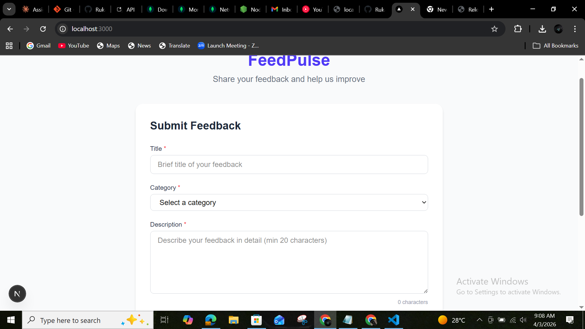
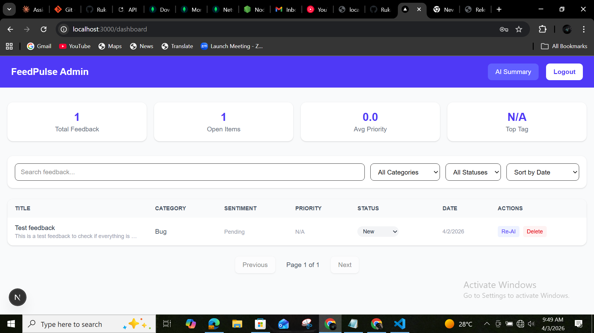

# FeedPulse — AI-Powered Product Feedback Platform

FeedPulse is a full-stack web application that lets teams collect product feedback and uses Google Gemini AI to automatically categorise, prioritise, and summarise them.

## Tech Stack
- **Frontend:** Next.js 14+, Tailwind CSS
- **Backend:** Node.js, Express.js
- **Database:** MongoDB + Mongoose
- **AI:** Google Gemini API
- **Auth:** JWT

## Features
- Public feedback submission form
- AI-powered analysis (category, sentiment, priority, tags)
- Protected admin dashboard
- Filter, search, sort feedback
- Status management (New / In Review / Resolved)
- AI weekly summary
- Rate limiting

## How to Run Locally

### Prerequisites
- Node.js v18+
- MongoDB installed locally
- Gemini API key from https://aistudio.google.com

### Backend Setup
```bash
cd backend
npm install
```
Create a `.env` file in the backend folder:
```
PORT=4000
MONGODB_URI=mongodb://localhost:27017/feedpulse
JWT_SECRET=feedpulse_super_secret_key_2026
GEMINI_API_KEY=your_gemini_api_key_here
ADMIN_EMAIL=admin@feedpulse.com
ADMIN_PASSWORD=admin123
```
```bash
npm run dev
```

### Frontend Setup
```bash
cd frontend
npm install
```
Create a `.env.local` file in the frontend folder:
```
NEXT_PUBLIC_API_URL=http://localhost:4000
```
```bash
npm run dev
```

### Access the App
- Feedback Form: http://localhost:3000
- Admin Dashboard: http://localhost:3000/dashboard
- Admin Email: admin@feedpulse.com
- Admin Password: admin123

## Screenshots



## API Endpoints
| Method | Endpoint | Description |
|--------|----------|-------------|
| POST | /api/feedback | Submit feedback |
| GET | /api/feedback | Get all feedback |
| GET | /api/feedback/:id | Get single feedback |
| PATCH | /api/feedback/:id | Update status |
| DELETE | /api/feedback/:id | Delete feedback |
| GET | /api/feedback/summary | AI trend summary |
| POST | /api/auth/login | Admin login |

## What I Would Build Next
- Email notifications when feedback status changes
- User authentication for submitters
- Analytics charts and graphs
- Export feedback to CSV
- Mobile app

## Environment Variables
| Variable | Description |
|----------|-------------|
| MONGODB_URI | MongoDB connection string |
| JWT_SECRET | Secret key for JWT tokens |
| GEMINI_API_KEY | Google Gemini API key |
| ADMIN_EMAIL | Admin login email |
| ADMIN_PASSWORD | Admin login password |